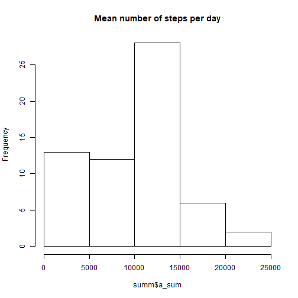
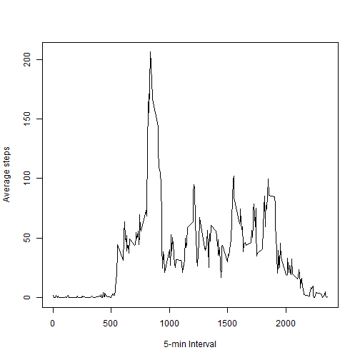
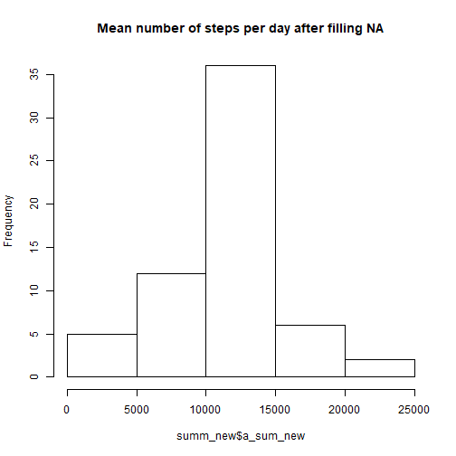
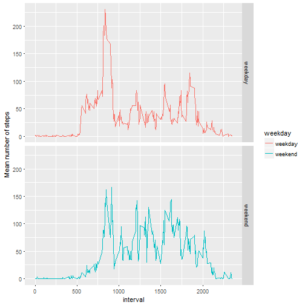

```r
knitr::opts_chunk$set(echo = TRUE, fig.path='Figs/')
```

# Project 1 of the Reproducible Research cours

## Loading and preprocessing the data


```r
setwd("C:/Users/Mar/Documents/formations/MOOCs/Coursera_DataScience/05_reproducible_research/w2_project/")

data<-read.csv('activity.csv', header=TRUE)

str(data)
```

```
## 'data.frame':	17568 obs. of  3 variables:
##  $ steps   : int  NA NA NA NA NA NA NA NA NA NA ...
##  $ date    : Factor w/ 61 levels "2012-10-01","2012-10-02",..: 1 1 1 1 1 1 1 1 1 1 ...
##  $ interval: int  0 5 10 15 20 25 30 35 40 45 ...
```

```r
data$date<-as.Date(as.character(data$date), format="%Y-%m-%d")
```


## Obtaining the mean total number of steps taken per day


```r
library(dplyr)
```

```
## 
## Attaching package: 'dplyr'
```

```
## The following objects are masked from 'package:lubridate':
## 
##     intersect, setdiff, union
```

```
## The following objects are masked from 'package:stats':
## 
##     filter, lag
```

```
## The following objects are masked from 'package:base':
## 
##     intersect, setdiff, setequal, union
```

```r
df<-tbl_df(data)
str(df)
```

```
## Classes 'tbl_df', 'tbl' and 'data.frame':	17568 obs. of  3 variables:
##  $ steps   : int  NA NA NA NA NA NA NA NA NA NA ...
##  $ date    : Date, format: "2012-10-01" "2012-10-01" ...
##  $ interval: int  0 5 10 15 20 25 30 35 40 45 ...
```

```r
per_date<-group_by(df, date)

# Obtain the total number of steps per day
summ<-summarise(per_date, a_sum=sum(steps, na.rm=TRUE))
#Make a histogram
hist(summ$a_sum, main="Mean number of steps per day")
```



```r
#Calculate the mean and median of the total number of steps per day
mean_steps<-mean(summ$a_sum)
median_steps<-median(summ$a_sum)
```

The mean number of steps per day is 9354.2295082.
The median nunmber of steps per day is 10395.


## Average daily activity pattern


```r
steps_int<-with(df, tapply(steps, interval, mean, na.rm=T))
plot(names(steps_int), steps_int, type="l", xlab="5-min Interval", ylab="Average steps")
```



```r
max_int<-max(steps_int)
name_max_int<-names(steps_int[steps_int=max_int])
```

The 5-minute interval corresponding to the maximum number of steps is 1705.


## Imputing missing values


```r
#Total number of missing data
miss_tot<-sum(is.na(df))

# New dataset with filled na
df_new<-df
miss<-df$interval[is.na(df_new$steps)]
index<-sapply(miss, function(x) which(names(steps_int)==x))
df_new$steps[is.na(df_new$steps)]<-steps_int[index]

# Obtain the new total number of steps per day
per_date_new<-group_by(df_new, date)
summ_new<-summarise(per_date_new, a_sum_new=sum(steps, na.rm=TRUE))
#Make a histogram
hist(summ_new$a_sum_new, main="Mean number of steps per day after filling NA")
```



```r
#Calculate the mean and median of the total number of steps per day
mean_steps_new<-mean(summ_new$a_sum_new)
median_steps_new<-median(summ_new$a_sum_new)
```

The total number of missing values is 2304.
The mean number of steps per day after filling the NA values is 1.0766189 &times; 10<sup>4</sup>, while the original one was 9354.2295082. Fillinig the missing data has increased the mean value per day. 
The median nunmber of steps per day after filling the NA values is 1.0766189 &times; 10<sup>4</sup>, while the orginale one was 10395. In this case, both values ar the same


## Differences in activity patterns between weekdays and weekends


```r
library(ggplot2)
# New variable 'weekday'
wd<-weekdays(df_new$date)
wkd<-wd
wkd[wd=="sábado" | wd=="domingo"]<-"weekend"
wkd[wd!="sábado" & wd!="domingo"]<-"weekday"

df_new$weekday<-as.factor(wkd)

steps_sum<-group_by(df_new, interval, weekday)
new_sum<-summarise(steps_sum, a_mean=mean(steps, na.rm=TRUE))

ggplot(new_sum, aes(interval, a_mean, col=weekday)) + facet_grid(weekday~.)+geom_line()+ylab("Mean number of steps")
```



---
output:
  md_document:
    variant: markdown_github
---
